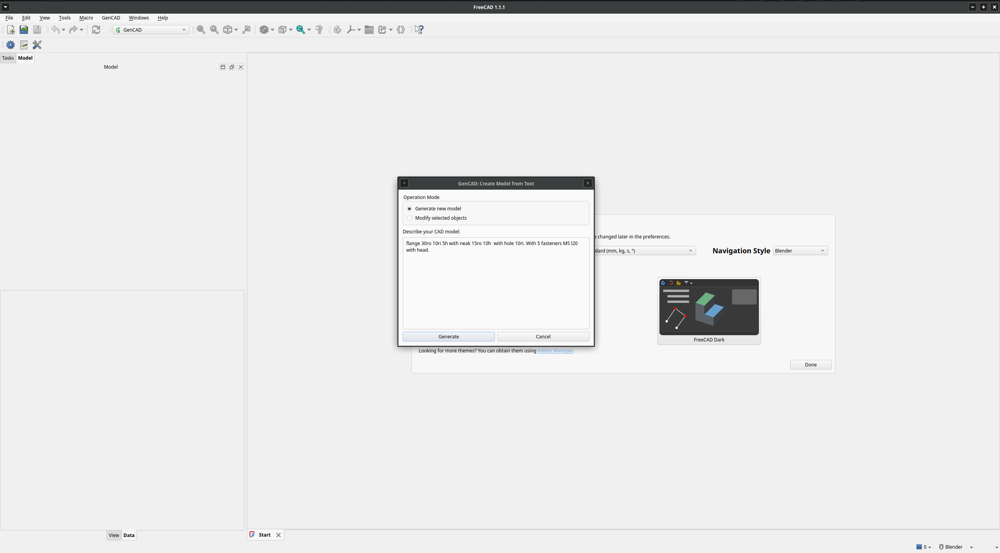
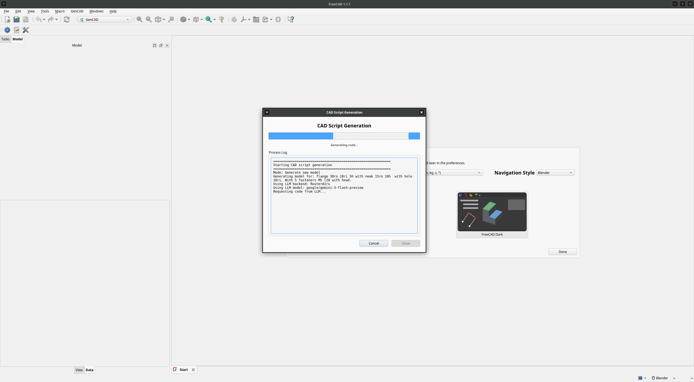
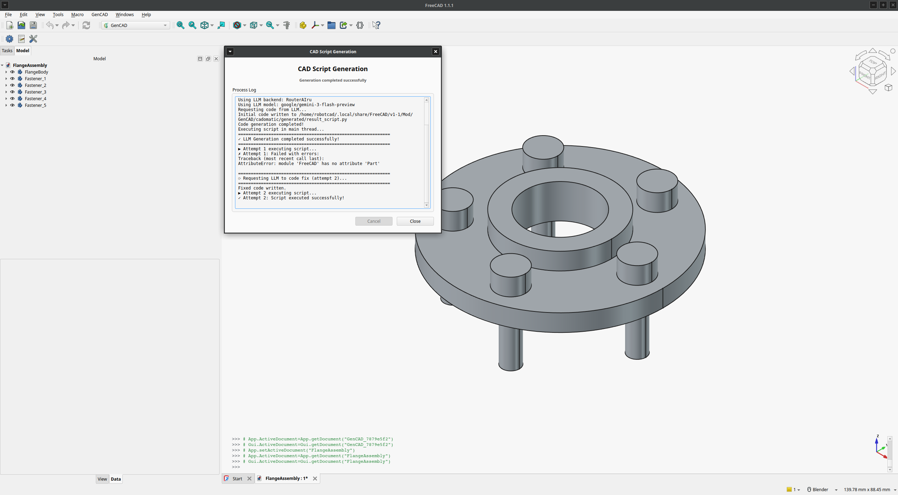
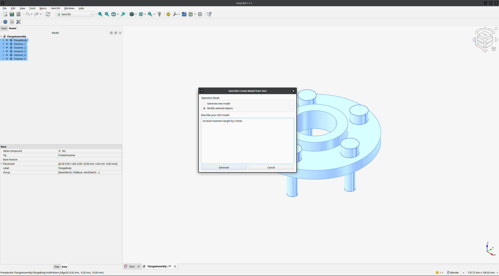
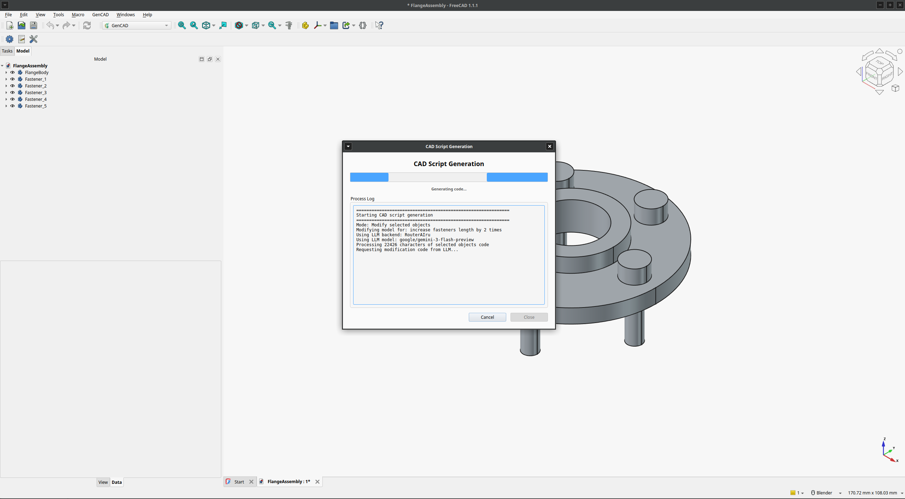
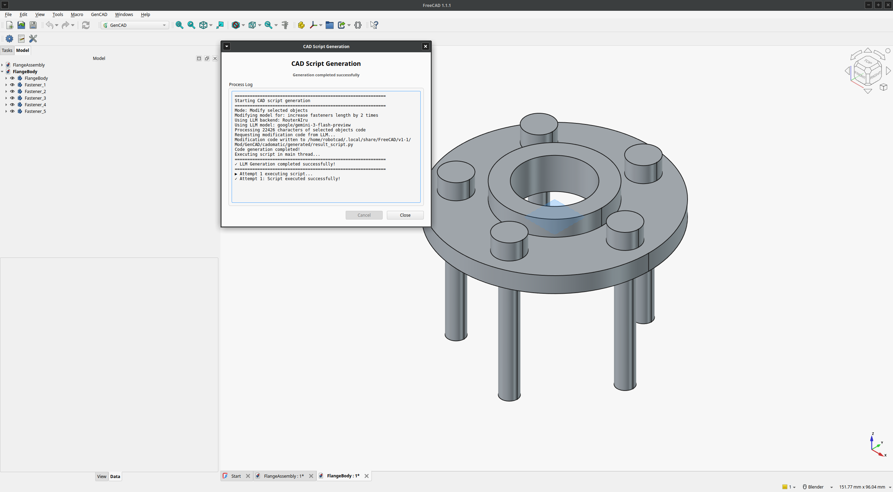
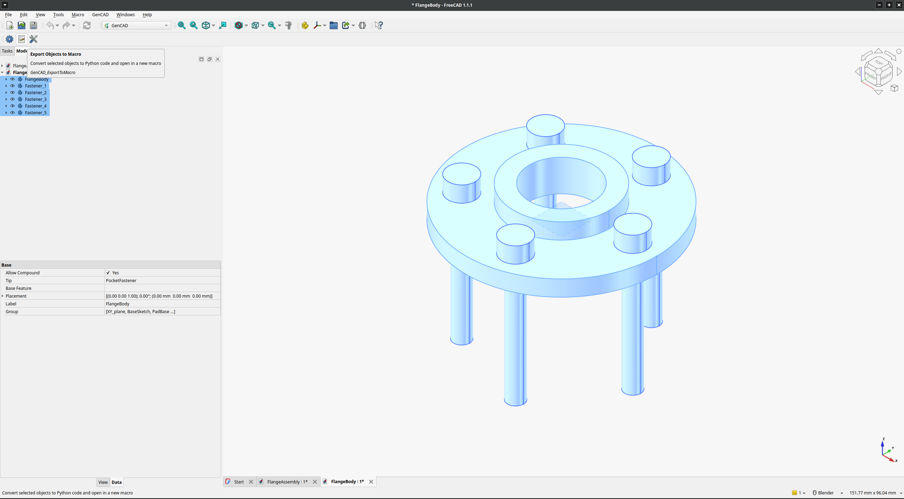
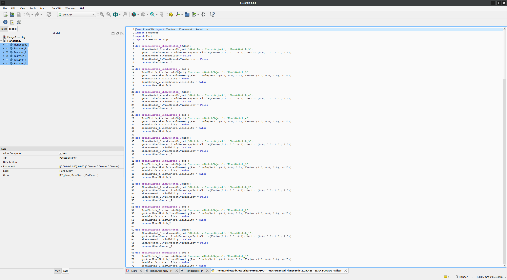
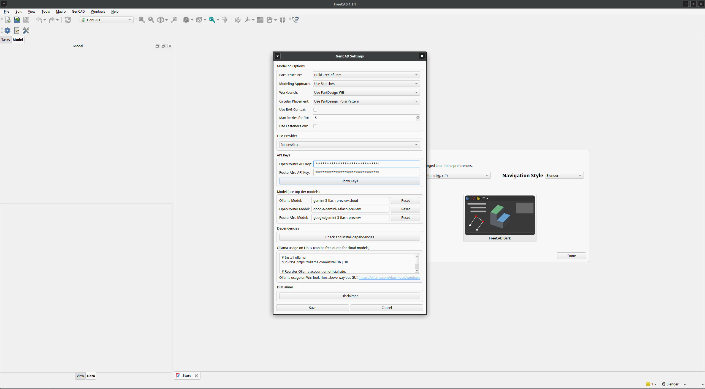

# GenCAD - FreeCAD AI Workbench

**GenCAD** is a FreeCAD AI workbench for creating, modifying, and exporting FreeCAD objects to code using natural language. Powered by LLM (Large Language Models), it enables you to generate CAD models from text descriptions and modify existing models through conversational prompts.

## Features

- **Text-to-CAD Generation**: Describe your CAD model in natural language and get a FreeCAD model (with Build Tree)
- **Model Modification**: Select existing objects and modify them using text descriptions
- **Export Objects to Macro**: Convert selected objects to Python code and save as a FreeCAD macro
- **Multiple LLM Providers**: Support for OpenRouter, Ollama (local/cloud), and RouterAIru
- **Configurable Modeling Options**:
  - Part structure: Build Tree of Part or Bake Part
  - Modeling approach: Auto, Sketches, or Primitives
  - Workbench: PartDesign or Part
  - Circular placement: PolarPattern or Placement
  - RAG context with FreeCAD documentaion (optional)
  - Fasteners workbench integration (optional)


## Disclaimer

> **GenCAD automatically tests the LLM-generated code directly in FreeCAD using its Python interpreter.**
>
> By using GenCAD, you should understand that the generated code could theoretically cause harm to your files. In practice, during all testing time, there has not been a single case of problems caused by the generated code. Nevertheless, remember that the generation depends on your request, model and has a randomness factor.
>
> **"Generation depends on your request"** means — do not ask GenCAD for anything that could harm your system.
>
> **IMPORTANT: You use GenCAD at your own risk and under your own responsibility. If you want more safety, use an isolated environment for FreeCAD.**
>
> **The generated model may be inaccurate or incorrect. Always verify the result.**
>
> **IMPORTANT: Use top-tier models from well-known providers (e.g., Google, Anthropic, OpenAI). Weak or small models may be unsuitable for use and produce incorrect or unusable CAD code.**

## Installation

### Via FreeCAD Addon Manager

1. Open FreeCAD
2. Click the **Edit -> Preferencies -> Addon Manager Options**
3. Go to the **Custom repositories** block
4. Click **+** button and enter the repository URL: `https://github.com/drfenixion/freecad.gencad`, branch: 'main'
5. Click **OK** to save the settings
6. Go to **Tools → Addon Manager**
7. Search for **GenCAD** in the Addon Manager
8. Click **Install**
9. Restart FreeCAD

### Manual Installation

1. Clone or download this repository
2. Copy the `GenCAD` folder to your FreeCAD `Mod` directory:
   - Linux: `~/.local/share/FreeCAD/Mod/` (FreeCAD 1.0)
            `~/.local/share/FreeCAD/v1-1/Mod/` (FreeCAD 1.1)
3. Restart FreeCAD

## Usage

After installation, switch to the **GenCAD** workbench in FreeCAD.

### Create Model from Text

1. Click **Create Model from Text** in the GenCAD toolbar
2. Select operation mode:
   - **Generate new model** — create a completely new model from description
   - **Modify selected objects** — modify selected objects (will generate new doc with modified objects)
3. Describe your CAD model in the text area (e.g., *"Create a 10mm cube with a 2mm hole through the center"*)
4. Click **Generate**
5. A progress dialog will show the generation status, including:
   - LLM code generation
   - Script execution testing
   - Automatic error fixing (up to configured max retries)

### Export Objects to Macro

1. Select one or more objects in the FreeCAD document
2. Click **Export Objects to Macro**
3. The objects will be converted to Python code and opened in a new macro editor

### Settings

Click **GenCAD Settings** to configure:

#### Modeling Options
| Option | Description |
|--------|-------------|
| **Part Structure** | Build Tree of Part (parametric) or Bake Part (simple geometry) |
| **Modeling Approach** | Auto, Use Sketches, or Use Primitives |
| **Workbench** | Use PartDesign WB or Use Part WB |
| **Circular Placement** | PartDesign_PolarPattern or Placement for Circle |
| **Use RAG Context** | Include FreeCAD documentation context for better generation |
| **Max Retries for Fix** | Maximum number of auto-fix attempts (1–10, default: 5) |
| **Use Fasteners WB** | Enable Fasteners workbench for attaching fasteners to circular edges |

#### LLM Provider
Choose your preferred LLM backend:
- **OpenRouter** — Cloud-based, supports multiple models (default)
- **Ollama** — Local or cloud models (supports `gemini-3-flash-preview:cloud` - may be free cloud quota)
- **RouterAIru** — Alternative cloud provider

### OPTIONAL: Ollama Setup (Linux)

```bash
# Install ollama
curl -fsSL https://ollama.com/install.sh | sh

# Register Ollama account on official site
# Do device signin and follow instructions
ollama signin

# Pull cloud model
ollama pull gemini-3-flash-preview:cloud

# Select Ollama Provider in GenCAD Settings and set the model to: gemini-3-flash-preview:cloud
```

For Windows, download from: https://ollama.com/download/windows

## Workflow

```
user_input + system_instruction → (LLM → generated code → test execution in FreeCAD) → loop of code fixing and verifying
```

1. User provides a text description of the desired CAD model
2. GenCAD sends the description to the configured LLM with system instructions
3. LLM generates FreeCAD Python code
4. Code is executed in a temporary FreeCAD document
5. If errors occur, the error log is sent back to the LLM for fixing
6. If no errors, a visual and code checks (model parameters suits to user request) are performed. Visual check from current top VLM can be wrong.
7. Steps 3–6 repeat until success or max retries is reached

## Project Structure

```
GenCAD/
├── InitGui.py                  # Workbench GUI initialization
├── GenCADCommands.py           # Command definitions (Create, Modify, Export, Settings)
├── GenCADConfig.py             # Configuration management
├── GenCADDialog.py             # Dialog windows (main dialog, settings)
├── GenCADProgressDialog.py     # Progress dialog with spinner
├── gencad_icon.svg             # Workbench icon
├── package.xml                 # FreeCAD package metadata
├── LICENSE                     # LGPL-2.1-or-later
├── cadomatic/                  # Core LLM integration module
│   ├── src/
│   │   ├── llm_client.py       # LLM API client
│   │   ├── rag_builder.py      # RAG vector store builder
│   │   ├── rag_extender.py     # RAG context extension
│   │   ├── dependency_checker.py
│   │   └── image_compare/      # VLM image comparison
│   ├── prompts/                # System prompts and options
│   ├── vectorstore/            # Pre-built RAG vector stores
│   └── generated/              # Generated scripts output
└── utils/
    └── objects_to_python.py    # Object-to-Python code exporter
```

## Requirements

- **FreeCAD** >= 1.0
- **Python** >= 3.11
- Internet connection (for cloud LLM providers)
- API keys for OpenRouter or RouterAIru (if using cloud providers)

## Screenshots

| Screenshot | Description |
|------------|-------------|
|  | Create Model dialog - enter your description |
|  | Creation Model in progress |
|  | Generated model result |
|  | Edit/Modify Model dialog |
|  | Modification in progress |
|  | Modified model result |
|  | Export objects to code |
|  | Exported code result |
|  | GenCAD Settings dialog |

## Tags

`AI` · `generative` · `text to CAD object` · `modify CAD object by text` · `convert CAD object to code`
